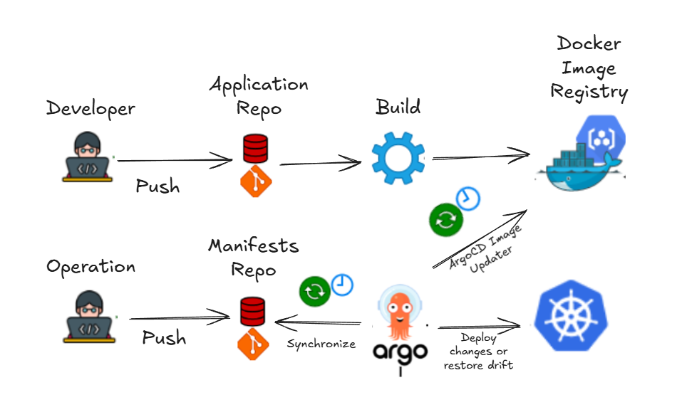
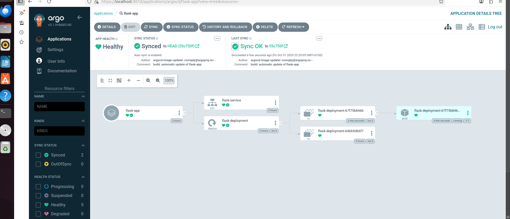
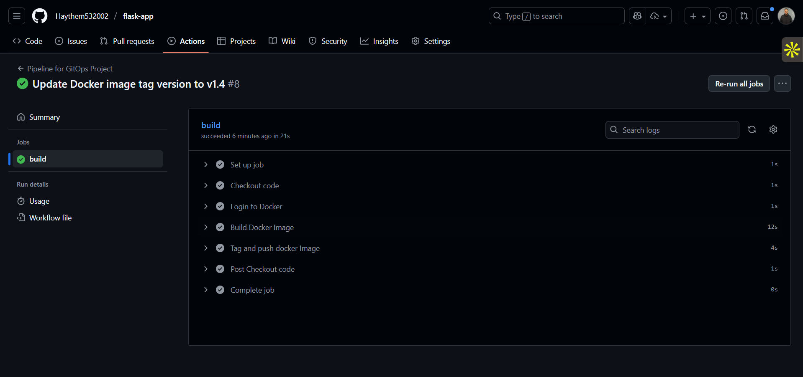
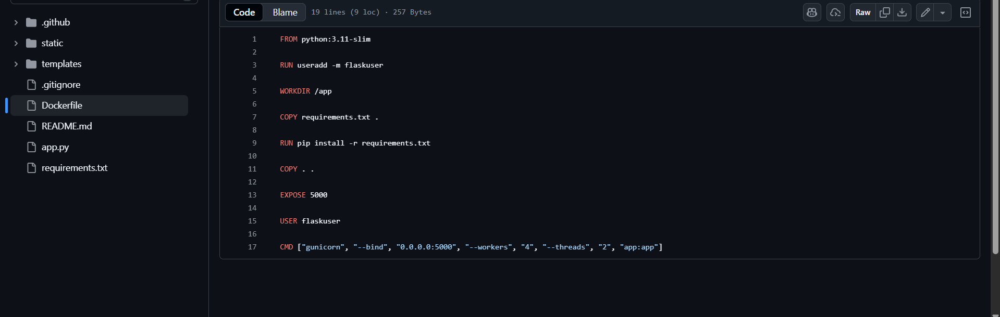

# Flask App (GitHub Actions + ArgoCD)

This repository contains a small Flask application along with a pipeline and Kubernetes deployment workflow that demonstrates GitOps with GitHub Actions, a separate manifests repository using Kustomize, and an ArgoCD application configured with ArgoCD Image Updater.

Badges: (optional - add your CI / Docker Hub badges here)

## Overview

Short summary:

- The application is a simple Flask web app (this repo).
- The infrastructure manifests (Kubernetes Deployment/Service, Kustomize overlays) live in a separate repository (manifests repo).
- CI is implemented with GitHub Actions: it builds the Docker image (single-stage Dockerfile), tags and pushes it to Docker Hub.
- ArgoCD is installed in the target Kubernetes cluster and pointed at the manifests repo. ArgoCD Image Updater watches Docker Hub tags and updates the image tag in the manifests repo when a new image is pushed by CI, causing ArgoCD to sync and deploy the new version.

Key outcomes:

- Fully automated build → push → deploy flow.
- Clear separation between application code (this repo) and deployment manifests (manifests repo).

## Project status / what I did

- I split the work across two repositories: one for the app (this repo) and one for Kubernetes manifests.
- Implemented CI using GitHub Actions in the app repo to build and push Docker images.
- Created a `Dockerfile` (single-stage) to produce a production image for the Flask app.
- In the manifests repo I added Kustomize overlays containing a `Deployment` and `Service` for the app.
- Deployed ArgoCD in the cluster and created an `Application` that points to the manifests repo.
- Installed and configured ArgoCD Image Updater to monitor Docker Hub for new tags and automatically update the manifests repo (or perform image updates) so ArgoCD can pick them up and deploy.

## Architecture diagram



## Images / screenshots

App / environment screenshots (from `imgs/`):





## How it works (end-to-end)

1. Developer pushes code to the app repository (this repo).
2. GitHub Actions workflow runs: builds the Docker image, tags it (e.g. `owner/app:sha-<short>`), and pushes to Docker Hub.
3. ArgoCD Image Updater watches Docker Hub for new tags for the image referenced in the manifests repo.
4. When a new tag appears, Image Updater updates the image reference in the manifests repository (or triggers an automated update depending on configuration).
5. ArgoCD detects the change in the manifests repo and performs a sync to the Kubernetes cluster, updating the `Deployment` with the new image tag.
6. The updated pods roll out the new Docker image automatically.

## Dockerfile — summary

This repository uses a single-stage `Dockerfile`. Typical contents for a small Python/Flask app Dockerfile:

- Use a slim Python base image (for example `python:3.11-slim`).
- Copy the application source and `requirements.txt` into the image.
- Install dependencies (via `pip install -r requirements.txt`).
- Expose the application port and run a production server (e.g., `gunicorn`) or the Flask dev server for local testing.

Example (already present in this repo): see `Dockerfile`.

## Kubernetes manifests (manifests repo)

- The manifests repo contains a Kustomize base with a `Deployment` and a `Service` for this app.
- Overlays are used per-environment (e.g., `overlays/staging`, `overlays/production`).
- The `Deployment` references the Docker image in Docker Hub (e.g., `dockerhub-user/flask-app:<tag>`).

Kustomize makes it easy to patch the image tag via the `images` field in `kustomization.yaml` so Image Updater (or manual processes) can update only the tag.

## ArgoCD and Image Updater

- ArgoCD watches the manifests repo and reconciles resources in the cluster to match the repo.
- ArgoCD Image Updater can be configured in one of two primary modes:
  - Update the manifests repo directly (commit new image tags to the repo).
  - Use ArgoCD's live image update features to patch the Application resource.
- In this setup Image Updater is configured to detect new Docker Hub tags and update the manifest (or notify ArgoCD) so the deployment happens automatically.

## How to run locally (dev)

On Windows (PowerShell):

1. Create and activate a virtual environment

```powershell
python -m venv .venv
.\.venv\Scripts\Activate.ps1
```

2. Install dependencies

```powershell
pip install -r requirements.txt
```

3. Run the app

```powershell
set-Content -Path .env -Value "FLASK_APP=app.py"
python -m flask run --host=0.0.0.0 --port=5000
```

Open http://localhost:5000 in your browser.

To build the Docker image and run it locally:

```powershell
docker build -t your-dockerhub-username/flask-app:dev .
docker run -p 5000:5000 your-dockerhub-username/flask-app:dev
```

To push to Docker Hub (CI does this automatically in the repo):

```powershell
docker tag your-dockerhub-username/flask-app:dev your-dockerhub-username/flask-app:latest
docker push your-dockerhub-username/flask-app:latest
```

## GitHub Actions (CI) — notes

- The CI workflow builds the Docker image, runs tests (if any), and pushes the image to Docker Hub.
- Configure secrets in GitHub: `DOCKERHUB_USERNAME`, `DOCKERHUB_PASSWORD` (or use a GitHub Package Registry token), and any other secrets required for the workflow.

Example high-level steps in CI:

1. Checkout
2. Set up Python
3. Build Docker image
4. Log in to Docker Hub
5. Push image
6. (Optional) Create and push a tag like `sha-<short>`

## Repo structure (this app)

```
./
├─ app.py                 # Flask application
├─ Dockerfile             # Dockerfile (build + runtime)
├─ requirements.txt       # Python dependencies
├─ templates/             # Flask HTML templates
├─ static/                # Static assets (CSS, JS)
├─ imgs/                  # Project images and screenshots (used by this README)
│  ├─ diagram.png
│  ├─ 1.png
│  ├─ 2.png
│  └─ 3.png
├─ README.md              # This file
```

## Where the manifests live

- Manifests (Kustomize overlays) are kept in a separate repository. That repository is the source ArgoCD watches.

Suggested `kustomization.yaml` snippet to allow Image Updater to patch the image tag:

```yaml
apiVersion: kustomize.config.k8s.io/v1beta1
kind: Kustomization
resources:
  - deployment.yaml
  - service.yaml
images:
  - name: dockerhub-user/flask-app
    newTag: "REPLACE_WITH_TAG"
```

## Tips and next steps

- Add CI tests to validate the app before pushing images.
- Configure GitHub Actions to create image tags with the commit SHA for traceability.
- Tighten ArgoCD Image Updater rules (semver, regex) to control when updates are applied.
- Set up health checks and readiness probes in the `Deployment` for safer rollouts.

## Files changed

- Replaced README content to match this Flask app + GitOps workflow and included images from `imgs/`.

## Verification

- This README references images found under `imgs/` in this repository. If you add or rename images, update the paths above.

---

If you'd like, I can also:

- Add a small health-check and readiness probe to the Kubernetes deployment.
- Add a sample GitHub Actions workflow file (if not present) that shows the exact steps I described.
- Create a short kustomize base and overlay example in this repo for testing with a local Kubernetes cluster.

Tell me which of those you'd like next and I will implement it.
